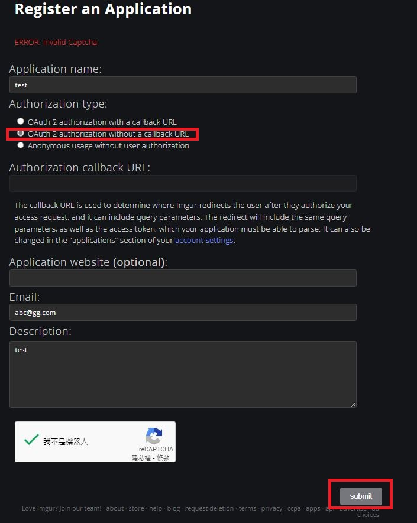
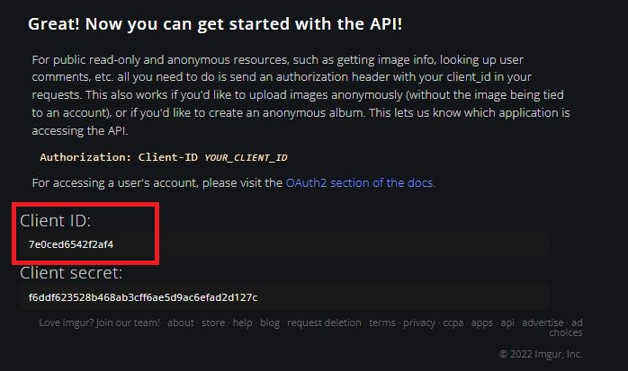
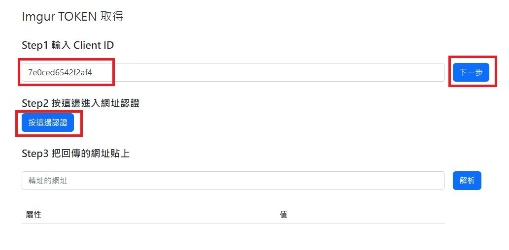
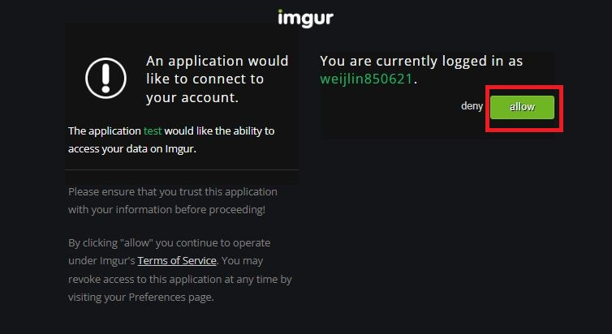
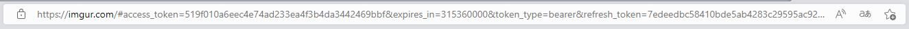
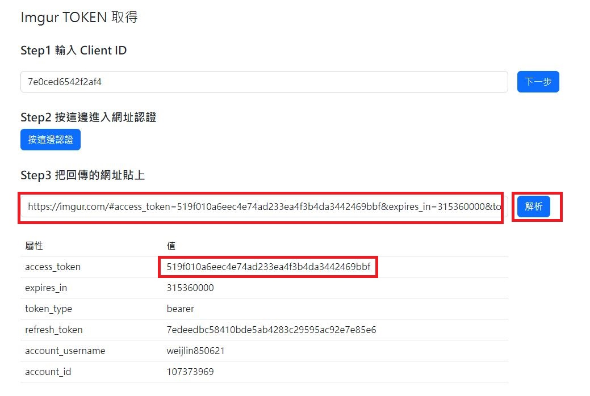

## step1

先至[Imgur](https://api.imgur.com/oauth2/addclient)產生 clientID，記得要選擇 `OAuth 2 authorization without a callback URL`    

## step2

將產生的 clientID 貼到[網站](https://weij0.github.io/imgurl-token-get/)中的 Step1 貼上並按下一步  
  
  

## step3 

到 Imgur 的網站進行授權登入，按下 `allow` 後會導至 Imgur 首頁，此時需複製下當下的網址 URL，URL 提供了相關 Token 資訊  

## step4

把網址貼回網站中 Step3 並解析就可以取得 `access_token`
